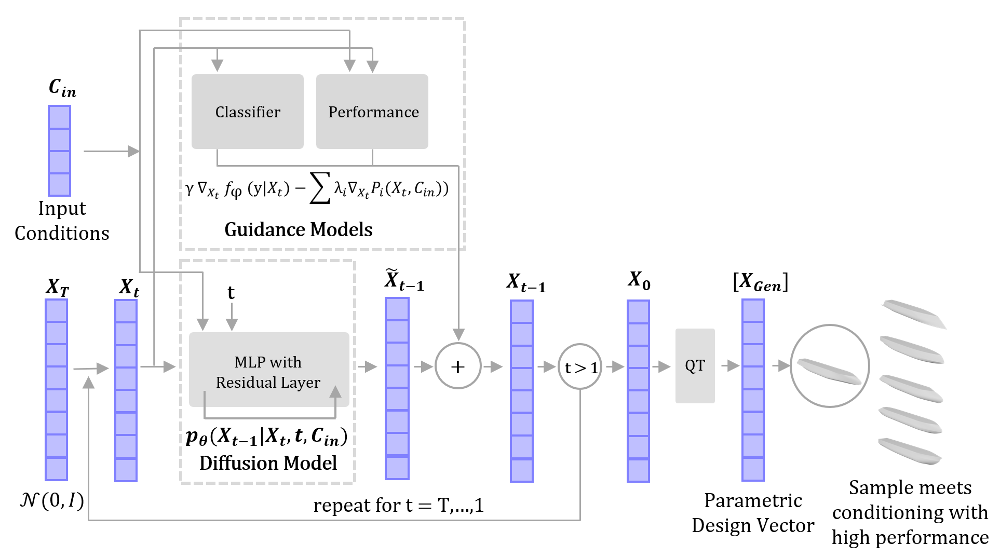

# C_ShipGen
C-ShipGen is a Conditional Guided Diffusion Model for Parametric Ship Hull Design. The model is trained to generate hull designs that satisfy a user's desired principal dimensions (Length, Beam, Draft, Depth, Block Coefficient, and Design Speed). C-ShipGen then generates hull designs with these design inputs while leveraging gradients from a total resistance surrogate model to produce designs with low drag. 

To sample from C-ShipGen, run through the notebook titled Run_CShipGen_Training_Sampling.ipynb. 

Within this repository are:

1) All training data for the model

2) Tools for training and sampling from C-ShipGen and regression models

3) Hull parameterization code to evaluate the designs

4) Sample code for Optimizing a hull design with NSGA-II

5) Pre-trained Generative and Regressive Models for C-ShipGen

